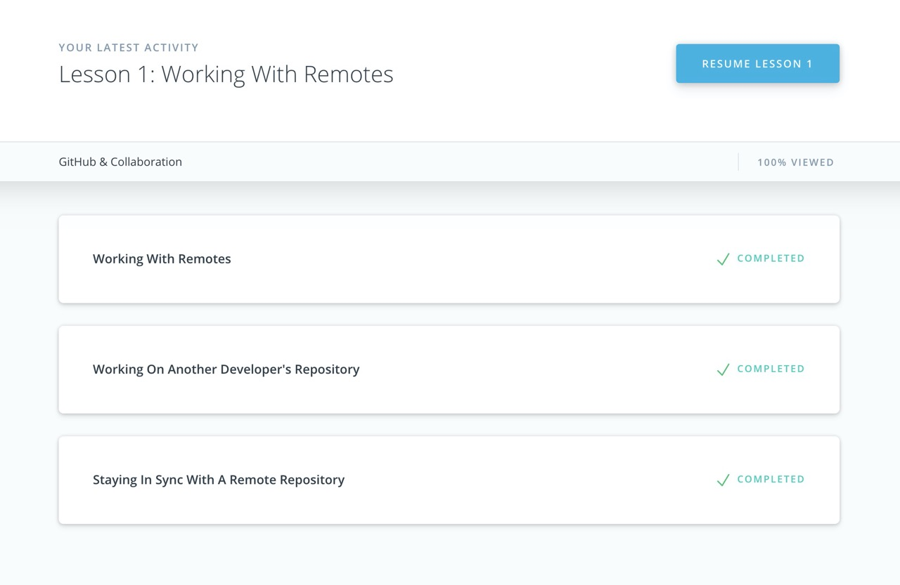

# kottans-backend
## Git and GitHub
 - [x] Version Control with Git
 
    Course is pretty basic, but I did learn a bit about proper usage of tags and reverts of the commits. Mainly because I have always struggled with counting commits back from the HEAD
 - [x] try.github.io
 
    Have already passed it a while ago, though Learngitbranching was quite a tool for me at the time.
   
 -  Extras 

    - [ ] [Git за 30 хвилин](https://codeguida.com/post/453)

    - [ ] [Git tips](http://sixrevisions.com/web-development/git-tips/) — consolidate your knowledge of Git

    - [x] [Learn git branching](http://learngitbranching.js.org) — improve your understanding of branching

    - [ ] [Fork a repo](https://help.github.com/en/articles/fork-a-repo#step-2-create-a-local-clone-of-your-fork) - freely   experiment with changes without affecting the original project; [Sync a repo](https://help.github.com/en/articles/syncing-a-fork) - keep a fork of the repository up-to-date with the upstream repository

    - [ ] [Communicating using Markdown](https://lab.github.com/githubtraining/communicating-using-markdown)

    - [ ] [TypingClub](https://www.typingclub.com/) — improve your typing speed

    - [x] [Как учиться и справляться с негативными мыслями](https://guides.hexlet.io/learning/)
    
## Unix Shell
- [x] Linux Survival\
    Modules 1-3 were quite easy, since I use Ubuntu at university, but 4th module was helpful and full of new information, that takes too much time to find and read but saves a lot more than that. 
       
    
 - [x] linuxcommand.org\
    Learned a lot about writing scripts. Though I do not get across them too often, I think it nice to know at least a necessary minimum.
 *  Extra Materials
    - [ ] [Linux Bash Shell Cheat Sheet](https://annawilliford.github.io/2016-04-02-UTA/workshop/Linux/bash_cheat_sheet.pdf)
    - [ ] [Advanced Bash-Scripting Guide. An in-depth exploration of the art of shell scripting](http://www.tldp.org/LDP/abs/html/index.html)
    - [ ] [A Guide to 100 (ish) Useful Unix Commands ](http://oliverelliott.org/article/computing/ref_unix/)

## Git Collaboration
I found latest section on rebasing, cherry-picks and other useful as never really used those commands, mainly because did not need to
summary

-  Extra materials
- [ ] [An Introduction to Git and GitHub by Brian Yu (CS50 course), video, ~40 min.](https://youtu.be/MJUJ4wbFm_A)
- [x] [Oh shit, git!](http://ohshitgit.com/)
- [ ] [Flight rules for git](https://github.com/k88hudson/git-flight-rules)
- [ ] [GitHub Learning Lab](https://lab.github.com/courses)