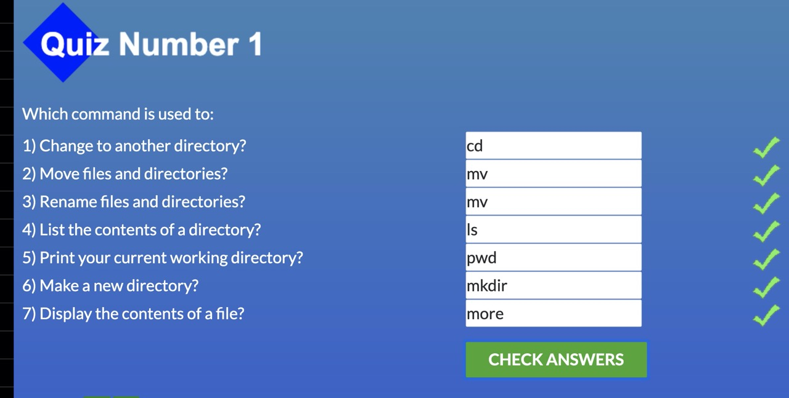
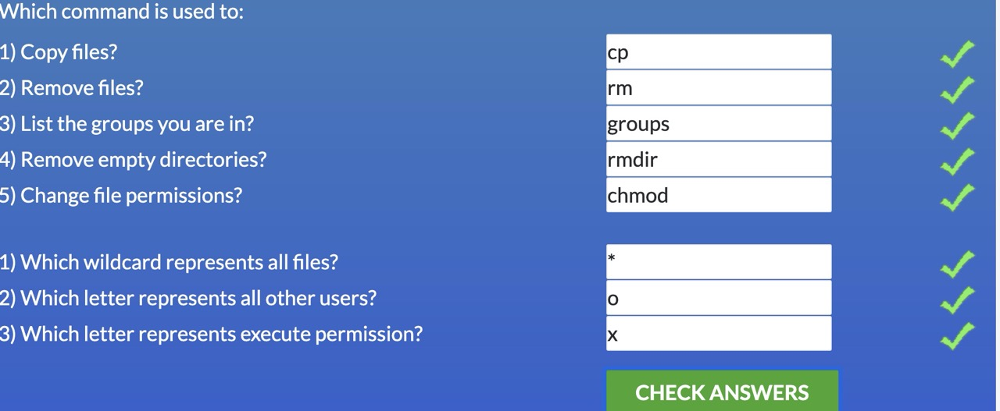
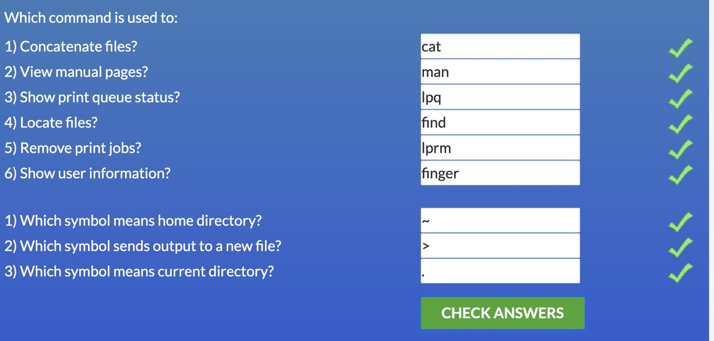
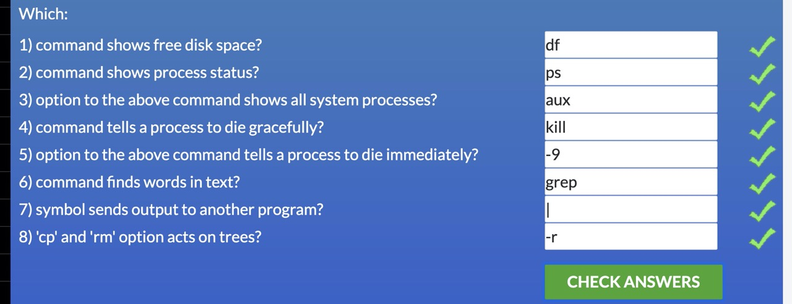
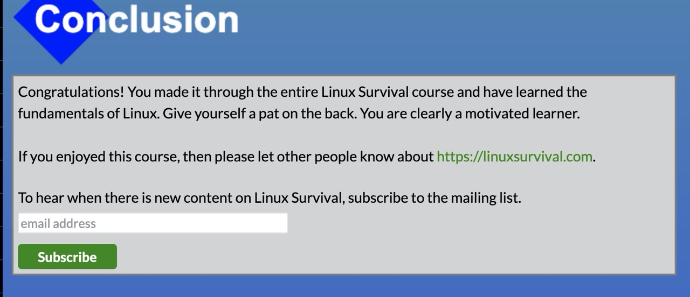

# kottans-backend
##Git and GitHub
 - [x] Version Control with Git
 
    Course is pretty basic, but I did learn a bit about proper usage of tags and reverts of the commits. Mainly because I have always struggled with counting commits back from the HEAD
 - [x] try.github.io
 
    Have already passed it a while ago, though Learngitbranching was quite a tool for me at the time.
   
 - [ ] Extras 
 
    In progress(~30 %)
    
##Unix Shell
- [x] Linux Survival\
    Modules 1-3 were quite easy, since I use Ubuntu at university, but 4th module was helpful and full of new information, that takes too much time to find and read but saves a lot more than that. 
    
    
    
    
    
    
 - [x] linuxcommand.org\
    Learned a lot about writing scripts. Though I do not get across them too often, I think it nice to know at least a necessary minimum.
    
